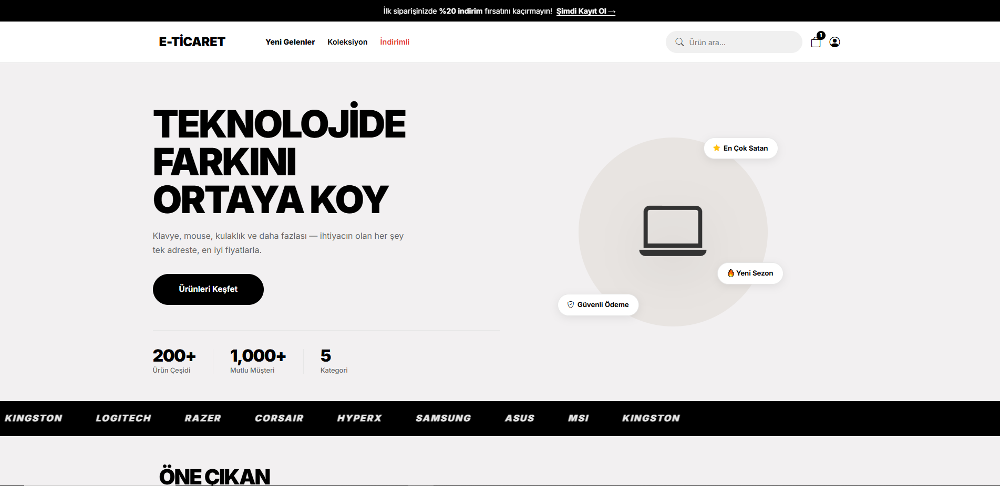
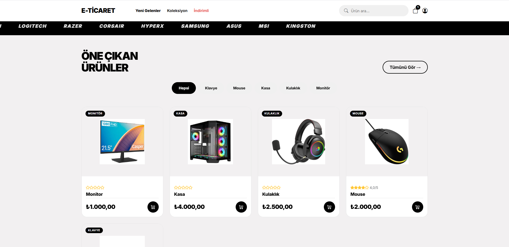
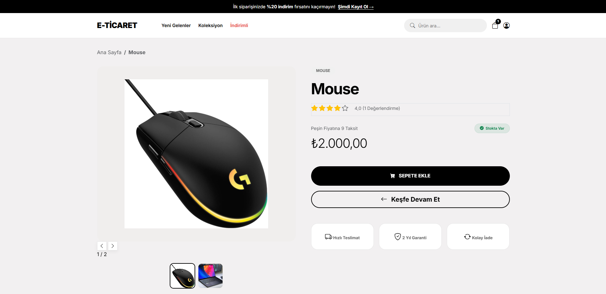
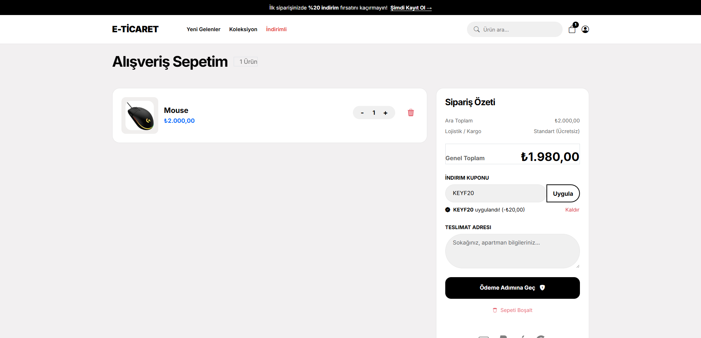
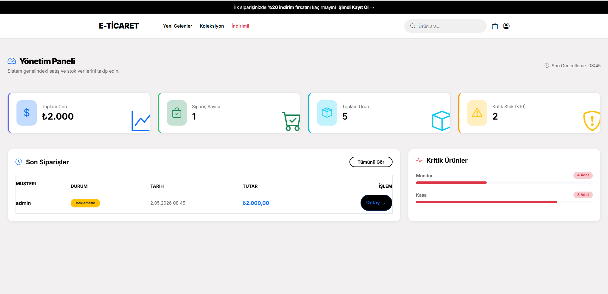
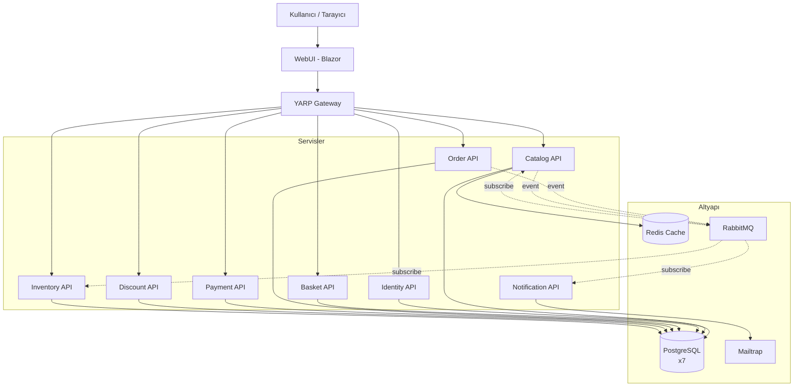

# E-Ticaret — Mikroservis Mimarili E-Ticaret Sistemi

.NET 10, Aspire orkestrasyonu ve Kubernetes üzerinde çalışan tam fonksiyonlu bir e-ticaret platformu. 8 mikroservis, RabbitMQ event-driven iletişim, Redis önbellek, JWT kimlik doğrulama, otomatik mail bildirimi ve K8s best practice'leri.


---

## Ekran Görüntüleri

### Anasayfa — Hero ve Marka Şeridi
Modern minimalist tasarım, dikkat çekici hero alanı, marka çağrıları (En Çok Satan, Yeni Sezon, Güvenli Ödeme) ve istatistikler. Alt kısımda otomatik kayan marka şeridi.



### Anasayfa — Öne Çıkan Ürünler
Kategori bazlı hızlı filtreleme (Hepsi / Klavye / Mouse / Kasa / Kulaklık / Monitör), her üründe etiket, puan ve hızlı sepete ekleme butonu.



### Ürün Detay
Çoklu görsel galerisi (slider + thumbnail), fiyat ve stok durumu, taksit bilgisi, garanti/teslimat/iade rozetleri. Aynı zamanda ürün yorumları ve puanlama sistemi.



### Sepet ve Kupon
Adet artırma/azaltma, ürün silme, kupon kodu uygulama (örnek: KEYF20 ile 20₺ indirim), kalıcı teslimat adresi (LocalStorage), sipariş özeti.



### Yönetim Paneli
Toplam ciro, sipariş sayısı, ürün stoku, kritik stok uyarıları, son siparişler tablosu ve stok seviyesi grafikleri.



---

## Mimari



---

## Mikroservisler

| Servis | Görev |
|---|---|
| **Identity API** | Kullanıcı kayıt, giriş, JWT token üretimi, profil yönetimi |
| **Catalog API** | Ürün CRUD, kategori, yorum, puanlama, görsel yükleme, Redis cache |
| **Basket API** | Sepet yönetimi, kupon uygulama |
| **Order API** | Sipariş oluşturma, ödeme entegrasyonu, sipariş geçmişi |
| **Payment API** | Mock ödeme işlemi, transaction kaydı |
| **Discount API** | İndirim kuponları, kupon doğrulama |
| **Inventory API** | Stok takibi, sipariş sonrası otomatik stok düşürme |
| **Notification API** | RabbitMQ event'lerini dinleyip mail bildirimi gönderme |
| **YARP Gateway** | Tüm servislere reverse proxy, tek giriş noktası |
| **WebUI** | Blazor Server tabanlı kullanıcı ve admin arayüzü |

---

## Teknik Özellikler

### Mimari ve Altyapı
- **Mikroservis Mimarisi** — Her servis kendi veritabanı ve sorumluluğuna sahip
- **.NET Aspire** — Tüm servisleri orkestre eden, service discovery ve telemetri sağlayan host
- **Kubernetes Deployment** — Tüm servisler Docker Desktop K8s üzerinde
- **YARP Gateway** — Tek giriş noktası, akıllı routing
- **RabbitMQ Fanout Exchange** — Aynı event'i birden fazla servisin alabilmesi için pub/sub mimarisi

### Güvenlik
- **JWT Authentication** — Token tabanlı kimlik doğrulama, 7 gün geçerlilik
- **BCrypt** — Şifre hash'leme
- **Kubernetes Secrets** — JWT key, mail token ve DB şifreleri Secret olarak saklanıyor
- **AuthRedirectHandler** — Token süresi dolduğunda otomatik logout ve yönlendirme

### Performans
- **Redis Distributed Cache** — Catalog API'de ürün listesi (1dk) ve ürün detayları (5dk) önbellekleniyor
- **Response time** — Cache hit durumunda DB'ye gitmeden milisaniyeler içinde cevap

### Dayanıklılık
- **Init Containers** — Veritabanı migration'ları ana container başlamadan önce ayrı bir init container'da çalışıyor
- **Migration Retry Loop** — DB pod'u henüz hazır değilse 20 deneme + 3 saniye bekleme
- **Persistent Volume Claims** — Her veritabanı için 1GB kalıcı depolama, pod restart'ında veri korunuyor
- **Health Checks** — Liveness ve readiness probe'ları ile pod sağlık kontrolü

### Event-Driven İletişim
- Sipariş oluşturulduğunda `OrderCreatedIntegrationEvent` yayımlanıyor
- Inventory API → stoğu düşürür
- Notification API → kullanıcıya mail gönderir
- Ürün güncellendiğinde `ProductUpdatedIntegrationEvent` yayımlanıyor → Inventory ürün adını günceller

---

## Özellikler

### Kullanıcı Tarafı
- Kullanıcı kayıt / giriş / profil güncelleme
- Ürün listeleme, kategori filtreleme, arama, sıralama
- Çoklu görsel desteği ve görsel galerisi
- Ürün detayı, yorum ve puanlama
- Favoriler sayfası
- Hızlı filtreler (yeni gelenler, indirimli, koleksiyon)
- Sepet yönetimi, kupon kodu uygulama
- Adres LocalStorage kayıt (her seferde yeniden yazma yok)
- Sipariş tamamlama, ödeme akışı
- Sipariş geçmişi ve detayı
- Otomatik mail bildirimi

### Admin Paneli
- Genel istatistikler (toplam ciro, sipariş, kritik stok)
- Ürün yönetimi (CRUD, görsel yükleme)
- Sipariş yönetimi (durum güncelleme)
- Kupon yönetimi
- Stok yönetimi

---

## Teknoloji Yığını

**Backend**
- .NET 10
- ASP.NET Core Web API
- Entity Framework Core 10
- .NET Aspire 13.1

**Frontend**
- Blazor Server (.NET 10)
- Bootstrap 5
- Custom CSS (SHOP.CO design system)

**Veritabanı ve Cache**
- PostgreSQL 16
- Redis 7

**Mesajlaşma**
- RabbitMQ (Fanout Exchange)

**Mail**
- MailKit
- Mailtrap (SMTP)

**Orkestrasyon ve Deployment**
- Kubernetes (Docker Desktop)
- Docker
- Kustomize
- Aspirate (Aspire → K8s manifest dönüşümü)

**Gateway**
- YARP (Yet Another Reverse Proxy)

**CI/CD**
- GitHub Actions

---

## Kurulum

### Gereksinimler
- .NET 10 SDK
- Docker Desktop (Kubernetes etkin)
- Local Docker Registry: `localhost:5000`

### İlk Kurulum

```powershell
# Yerel registry başlat
docker run -d -p 5000:5000 --name registry registry:2

# Veritabanlarını ve Redis'i kur
.\setup-db.ps1

# Tüm servisleri build edip deploy et
.\deploy.ps1
```

### Erişim

| Hizmet | URL |
|---|---|
| Web Sitesi | http://localhost:8081 |
| Gateway API | http://localhost:8080 |
| Aspire Dashboard | `kubectl port-forward service/aspire-dashboard 18888:18888` → http://localhost:18888 |

### Test Hesabı

| Rol | Kullanıcı | Şifre |
|---|---|---|
| Admin | `admin` | `admin123` |

---

## Proje Yapısı

```
ECommerce/
├── ECommerce.AppHost/          # Aspire orkestrasyon
│   └── aspirate-output/        # K8s manifestleri
├── ECommerce.ServiceDefaults/  # Ortak Aspire ayarları
├── Common/                     # DTO'lar, EventBus, ortak modeller
├── Services/
│   ├── Catalog.API/
│   ├── Basket.API/
│   ├── Order.API/
│   ├── Payment.API/
│   ├── Identity.API/
│   ├── Discount.API/
│   ├── Inventory.API/
│   └── Notification.API/
├── YarpGateway.API/            # API Gateway
├── WebUI/                      # Blazor frontend
├── deploy.ps1                  # Build + K8s deploy scripti
├── setup-db.ps1                # İlk DB kurulumu
└── .github/workflows/ci.yml    # GitHub Actions CI
```

---

## Geliştirme Notları

Proje portfolyo amaçlı geliştirilmiş olup; mikroservis mimarisi, Kubernetes deployment, event-driven iletişim ve modern .NET stack'ini gerçek bir senaryoda göstermek üzere tasarlanmıştır.

**İletişim:** ahmetkoc.iletisim@gmail.com
